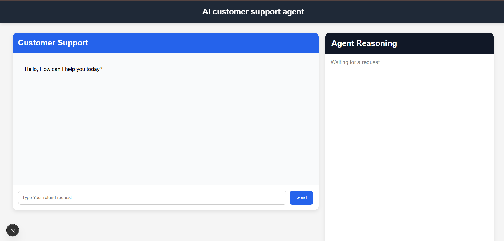
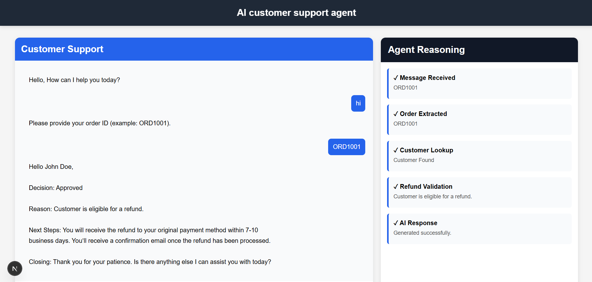

# 🤖 AI Customer Support Agent

An AI-powered customer support application built with **Next.js** that processes e-commerce refund requests using an AI agent, business validation tools, and real-time reasoning logs.

Designed as a product vertical slice for an AI Customer Support Agent.

---

## ✨ Features

- 💬 AI-powered customer chat interface
- 📋 Mock CRM with 15 customer profiles
- 📖 Refund policy validation
- 🧠 Agent orchestration with business tools
- 🔍 Automatic order ID extraction
- ✅ Refund eligibility validation
- 📜 Real-time agent reasoning logs
- 🎨 Clean and responsive UI
- ⚡ Built with Next.js App Router

---

## 🖥️ Demo

### Customer Chat

- Ask for a refund using an order ID.
- AI validates the request.
- Returns a professional response.

Example:

```
Refund for ORD1001
```

---

### Agent Reasoning

Every request generates live reasoning logs such as:

```
✓ Message Received

✓ Order ID Extracted

✓ Customer Found

✓ Refund Policy Validated

✓ AI Response Generated
```

---

## 🏗️ Architecture

```
Customer

      │
      ▼

Chat UI (Next.js)

      │
      ▼

API Route

      │
      ▼

Agent Controller

      │
      ├──────────────┐
      ▼              ▼

 Business Logic     OpenRouter

      │

Customer Lookup

Refund Validation

Policy Check

      │
      ▼

Final AI Response
```

---

## 📁 Project Structure

```
ai-support-agent
│
├── app
│   ├── api
│   │   └── agent
│   ├── dashboard
│   ├── layout.js
│   ├── page.js
│   └── globals.css
│
├── components
│   ├── Chat
│   ├── Navbar
│   └── ReasoningPanel
│
├── data
│   ├── customers.json
│   └── refund-policy.txt
│
├── lib
│   ├── agent.js
│   ├── logger.js
│   ├── openrouter.js
│   ├── prompts.js
│   ├── tools.js
│   └── utils.js
│
└── public
```

---

## 🧠 Agent Workflow

1. Customer submits a refund request.
2. Agent extracts the Order ID.
3. Customer record is retrieved.
4. Refund eligibility is validated.
5. AI generates a customer-friendly response.
6. Every step is logged for the admin panel.

---

## 🛠️ Business Rules

The backend enforces refund rules before the AI responds.

### Refund is approved when

- Order has been delivered
- Request is within 30 days
- Product is refundable
- Refund hasn't already been processed

### Refund is denied when

- Customer not found
- Order exceeds refund window
- Product is digital
- Refund already processed
- Order not delivered

---

## 🧰 Tech Stack

### Frontend

- Next.js 15
- React
- JavaScript
- CSS

### AI

- OpenRouter
- OpenAI SDK

### Backend

- Next.js API Routes

### Data

- JSON Mock CRM
- Refund Policy Text File

---

## 🚀 Installation

Clone the repository

```bash
git clone https://github.com/pawanx/ai-customer-support-agent.git
```

Install dependencies

```bash
npm install
```

Create an environment file

```env
OPENROUTER_API_KEY=your_api_key
```

Run locally

```bash
npm run dev
```

Open

```
http://localhost:3000
```

---

## 📸 Screenshots

### Customer Chat



---

### Agent Reasoning 



---

## 🔮 Future Improvements

- Voice support
- Database integration
- Authentication
- Persistent chat history
- LangGraph agent loop
- Admin analytics dashboard
- Email notifications
- Multi-language support

---

## 👨‍💻 Author

**Pawan Mishra**

GitHub: https://github.com/pawanx

LinkedIn: https://www.linkedin.com/in/pawan-mishra-08b3b9133/

---

## 📄 License

This project was created as part of a technical assessment and is available for educational purposes.